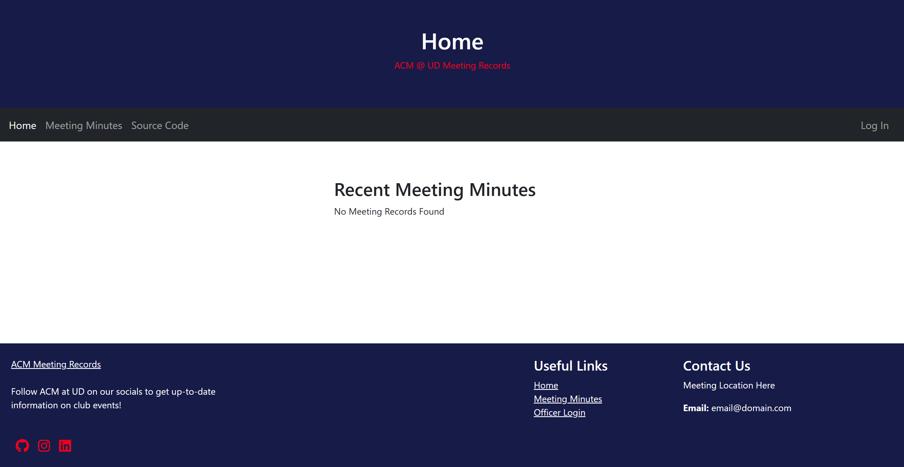

<!-- PROJECT HEADER -->
 

<h3 align="center">ACM Meeting Records</h3>
  

    A web app system for recording attendance and notes for ACM meetings.
     
  

<!-- TABLE OF CONTENTS -->

  
Table of Contents

  <ol>
    <li>
      <a href="#about-the-project">About The Project</a>
      <ul>
        <li><a href="#built-with">Built With</a></li>
      </ul>
    </li>
    <li>
      <a href="#getting-started">Getting Started</a>
      <ul>
        <li><a href="#installation">Installation</a></li>
      </ul>
    </li>
    <li><a href="#usage">Usage</a></li>
    <li><a href="#roadmap">Roadmap</a></li>
    <li><a href="#license">License</a></li>
    <li><a href="#contact">Contact</a></li>
    <li><a href="#acknowledgments">Acknowledgments</a></li>
  </ol>

<!-- ABOUT THE PROJECT -->
## About The Project

  

 
This is a basic landing page for a new installation of the application.

### Built With

* Python
* Flask
* SQLITE3
* Docker

(<a href="#readme-top">back to top</a>)

<!-- GETTING STARTED -->
## Getting Started

This is an example of how you may give instructions on setting up your project locally.
To get a local copy up and running follow these simple example steps.

### Installation

Check out the <a href="https://github.com/acm-udayton/ACM-Meeting-Records/blob/main/docs/quickstart.md">quickstart guide</a> for application setup!

(<a href="#readme-top">back to top</a>)

<!-- USAGE EXAMPLES -->
## Usage

Visit localhost:5000 on the device that is running the server. Alternatively, visit your server's IP via port 5000 from another device on the network. 

#### Web Application
* Accounts & Autgentication (sign up, log in, sign out, update)
* Meeting Management (create, start, end)
* Meeting Attendance (check-in, live attendee tracking)
* Meeting Minutes (create, update, view)

#### Administrator Utilities
* Make ENV Credentials.

(<a href="#readme-top">back to top</a>)

<!-- ROADMAP -->
## Roadmap

See the [open issues](https://github.com/acm-udayton/ACM-Meeting-Records/issues) to add to the list of proposed features (and known issues).

(<a href="#readme-top">back to top</a>)

<!-- CONTRIBUTING -->
## Contributing

Contributions are what make the open source community such an amazing place to learn, inspire, and create. Any contributions you make are **greatly appreciated**.

If you have a suggestion that would make this better, please fork the repo and create a pull request. You can also simply open an issue with the tag "enhancement".
Don't forget to give the project a star! Thanks again!

(<a href="#readme-top">back to top</a>)

<!-- LICENSE -->
## License

Distributed under the MIT License. See `LICENSE.txt` for more information.

(<a href="#readme-top">back to top</a>)

<!-- CONTACT -->
## Contact

Joseph Lefkovitz - [GitHub](https://github.com/lefkovitzj/) - [LinkedIn](https://www.linkedin.com/in/joseph-lefkovitz/)

Project Link: [https://github.com/acm-udayton/ACM-Meeting-Records](https://github.com/acm-udayton/ACM-Meeting-Records)

(<a href="#readme-top">back to top</a>)

<!-- ACKNOWLEDGMENTS -->
## Acknowledgments

* [Flask](https://pymupdf.readthedocs.io/), which runs the web server for the application.
* [SQLITE3](https://www.sqlite.org/docs.html), which serves as the application's databse.
* [Docker](https://docs.docker.com/), which is used for containerization of the application.

(<a href="#readme-top">back to top</a>)

